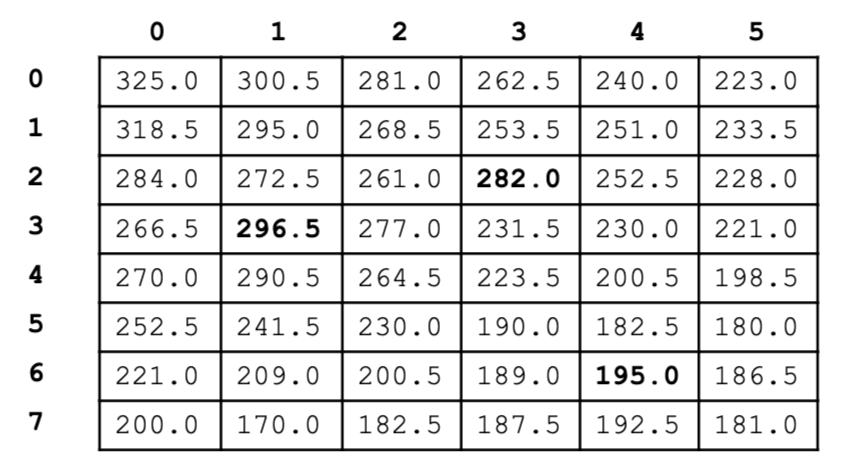

Instructions
A two-dimensional array of heights is represented in the height_map class in the file *heights.py*.

1. Write the HeightMap method isPeak, which takes parameters r and c, which represent valid row and column indices respectively for the two-dimensional array heights. The method returns true if the following conditions for the element of heights at row r, column c are satisfied.
    * The element is not in the border of the array (in the first row or last row or first column or last column)
    * The element is strictly greater than (not equal to) all 8 adjacent values in the two-dimensional array (these are the values directly above/below and to the left/right of the element, as well as the elements diagonally adjacent to the element, i.e. above & left, above & right, below & left, and below & right)
For example, suppose heights is represented by the table shown below, where heights.length is 8 and heights[0].length is 6.

The cells corresponding to peaks in this data are shown in bold. The following table shows the results of several calls to isPeak.

r|c|*isPeak*(r, c)
2|3|true
3|1|true
6|4|true
4|3|false
0|0|false

The method signiture is given below:

<code>
/** @param r a valid row index in heights
  * @param c a valid column index in heights
  * @return true if the height at row r, column c is not at the edge of the 
  * two-dimensional array heights, and is greater in value than all 8 surrounding
  * values; false otherwise.
  */
public boolean *isPeak*(int r, int c)
</code>